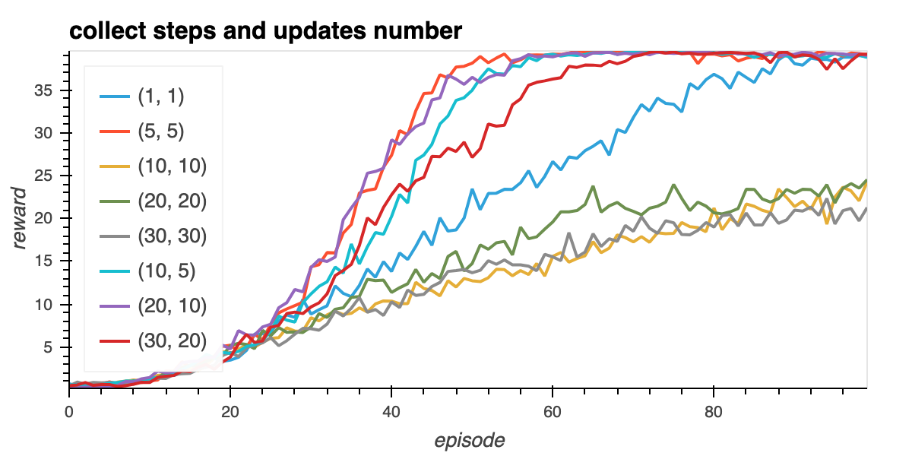
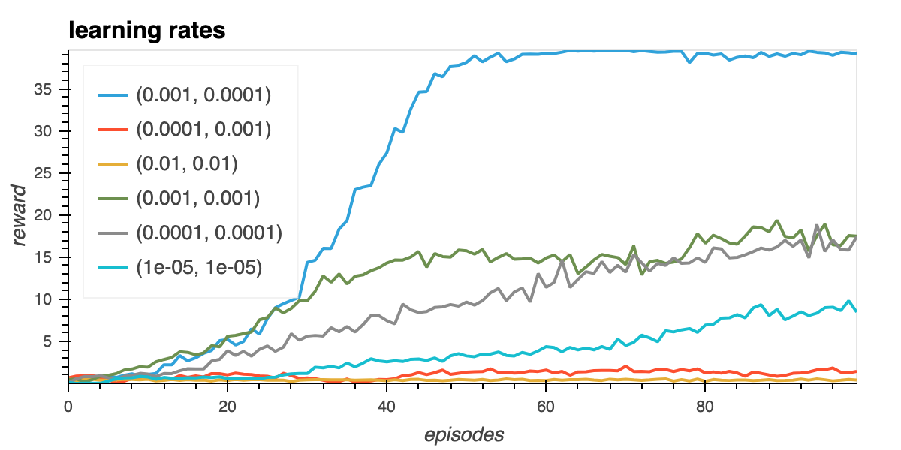
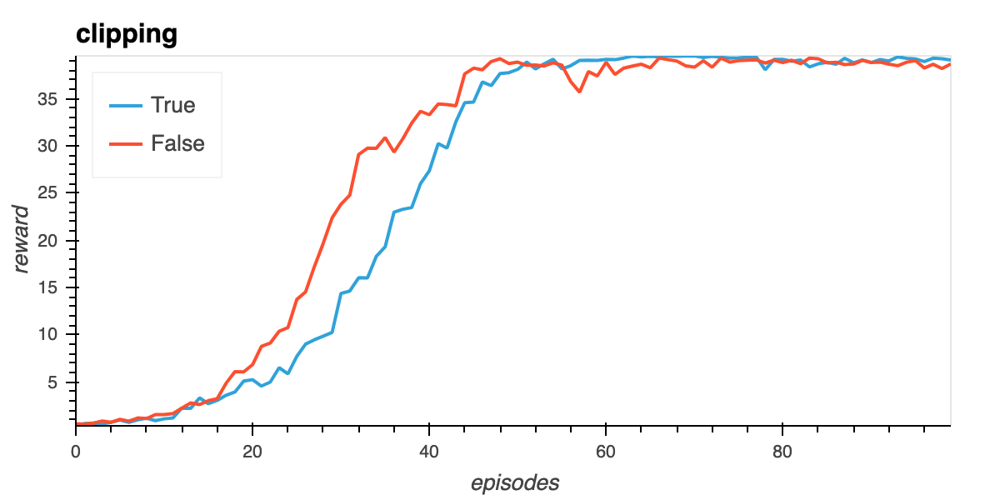
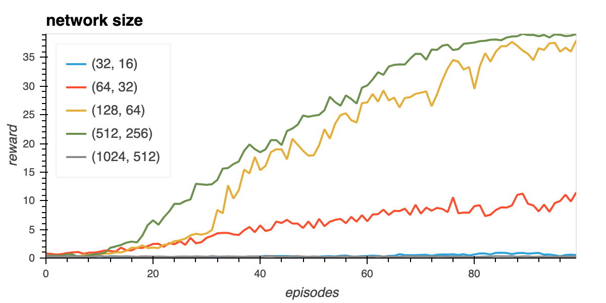

# Learning algorithm.

The agent uses the DDPG reinforcement strategy to learn from interactions with the environment, as explained in this [paper](https://arxiv.org/pdf/1509.02971.pdf).

Agent is trained in file `train.py`.

The DDPG algorythm is said to be part of Actor Critic models, but in fact differs from the plain vanilla Actor-Critic algorithm.
The DDPG agent is made of:
-  an `Actor` neural network, which uses a deterministic policy to decide which action to take, is trained using the deterministic policy gradient algorithm.
- a `Critic` neural networkm, calculating action value, is trained using TD-error.

In order to be more stable, aditional `target` copies are made of both Actors and Critic, and soft update is used to gradually update the `target` weights from `local` values, while networks are trained.
Experioence replay is also used to improve stability: past experience run against the environment are stored in a buffer, and each agent training is made on a random selection of past trajectories, then preventing sequences of actions reenforcing themselves.

Structure is as follows:

- Actor
    Input Layer: 33
    FCL (fully connected layer) 1: 256 (relu activation function)
    FCL 2: 128 (relu)
    Output Layer: 4 (actions)

- Critic
    Input Layer: 33
    FCL 1: 256 + 4 (action inputs)  (relu)
    FCL 2: 128 (relu)
    Output Layer: 1 (expected return)

# Implemented improvements:

Aditionally to the initial code provided in Udacity repository, we implemented following improvements:

- experience replay: we decided to parametrize the number of consecutives episodes collected to the buffer before training the actors, as well as the number of trajectories used for each session of training. See later for optimal parameters.

- gradient clipping was also implemented for the actor network to increase stability.

# Improvement in agent performance varying hyperparameters:

In order to run all simulations, insert at the end of `train.py` file range of parameters you want to run, then run `python train.py`. Simulation results will be stored in subdirectory `./results`.

Here are hyperparameters we have tested;

 - collect steps and update trajectories number:

    We see that all agants manage to learn, but (10,10), (20,20), (30,30) stay at a low level, while (5,5), (20,10) (10,5) converge very quickly to a high level with a very good stability afterwards.
    We observe a great sensitivity to these parameters for learning speed.

 - learning_rates:

    For Actor and Critic learning rates, we see again a great variability, from almost flat learning for high learning rates (1e-2, 1e-2) to fastest learning for (1e-3, 1e-4)

 - clipping:

    We implemented clipping for the Critic model, but as shown in graph below, no real improvement is gained with clipping, at least in combination with others chosen parameters values.

 - network neurones number:

    Finally we made simulations with different network size. We see that for low dimensions like (32,16), (64,32) the network size is too low to capture the dimensionality of the problem.
    We see best learnings for (256, 128) and (512, 256) values, while it's collapsing for (1024, 512) size.

As we can see, agent learning is highly affected by parameters, and tuning is key for agents learning speed and stability.

# Most successfull agent weights:

We saved pytorch agent weights into file: `checkpoint_actor.pth` For this best agent, we reach the target of a reward of 39 for less than 50 episodes.
    

## Next steps for improvements :

Evolutions in DQN might improve current agant performance, like a combination of evolutions of plain vanilha dqn, gathered into a rainbow model.

Modifying inputs to consider a full pixel image might as well improve performance, as more informations would be available to take decisions. In this case, neural network structure should be modified to contain convolution units to detect pattern in input image.

    
    